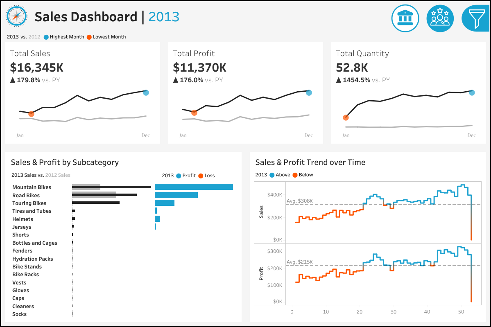
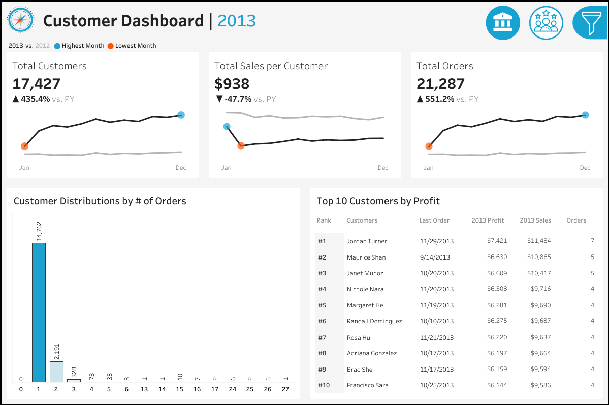

# 📊 Sales and Customer Analysis Dashboards Using Tableau

## 📌 Project Overview
This project features two interactive dashboards built with Tableau: a **Sales Dashboard** and a **Customer Dashboard**. The dashboard are desinged to analyse sales performance, customer behaviors and key business trends, focusing on clear KPI tracking, trend analysis and interactive exploration.

## 🧩 Dashboards Summary
### 📈 Sales Dashboard
**Purpose:** Track year-over-year sales performance and identify trends

**Key Features:** 
- **KPI Overview:** Total sales, profit and quantity (current vs. previous year)
- **Monthly Trends:** Highlighting months with with highest or lowest sales
- **Product Subcategory Comparison:** Sales and profit comparision across product subcategories
- **Weekly Trends**: Weekly sales and profit analysis with averages and deviations



### 👥 Customer Dashboard
**Purpose:** Understand customer behavior, loyalty and value generation

**Key Features:** 
- **KPI Overview:** Total customers, sales per customer and total orders (current vs. previous year)
- **Monthly Trends:** Highlighting months with with highest or lowest sales
- **Customer Distribution:** Analysis customers based on number of orders
- **Top 10 Customers:** Ranked by profit with additional metrics



## 🔧 Key Skills Demonstrated
- Data Visualisation and Dashboard Design
- KPI Development and Comparative Analysis
- Customer Segmentation and Sales Trend Analysis
- Data Storytelling and Interactive Exploration

## 📦 Repository Structure
```
Sales-and-Customer-Insights-Visualisation/
│
├── datasets/                                 # Raw datasets used for the project 
│                                               (sales transactions, customer and product data)
|
├── images/                                   # Dashboard images
│   ├── customer_dashboard.png                # Customer dasbboard image
│   ├── sales_dashboard.png                   # Sales dashboard image
│
├── LICENSE                                   # License information for the repository
├── README.md                                 # Project overview and information
├── Sales & Customer Dashboards.twbx          # Tableau dashboard
```
